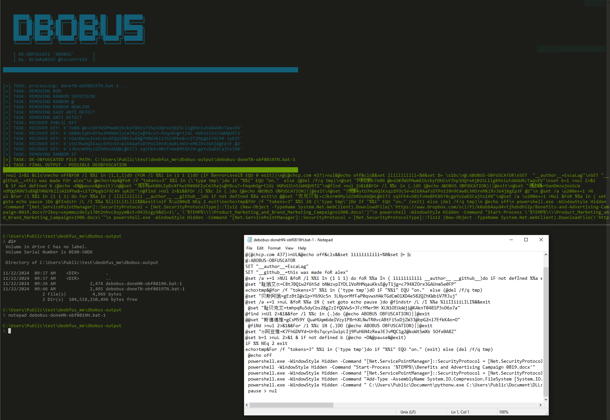

# DBOBUS
Description: A simple python script to de-obfuscate ABOBUS batch script obfuscator.

## Introduction:
The ABOBUS Obfuscator, developed by EscaLag, is a batch script obfuscation tool designed to obscure and protect code written in batch programming. It is recognized for its effectiveness in making batch files challenging to read and reverse-engineer by using obfuscation techniques. 

This Python Script can roughly de-obfuscate the actual script being obfuscated by this ABOBUS obfuscator.

## NOTE:
Due to the layered and customizable obfuscation techniques employed by the ABOBUS obfuscator, the de-obfuscation process implement by this de-obfuscator, may require specific adjustments tailored to the features utilized in the obfuscated malware samples. These tweaks are essential to accurately reverse the obfuscation and analyze the underlying code. The complexity of the de-obfuscation effort can vary depending on the obfuscation options selected during the encoding process.

## Simple HOWTO:

https://github.com/user-attachments/assets/db908489-3931-4ad5-97aa-32c6b924b265

## Example Output:

 </img>
